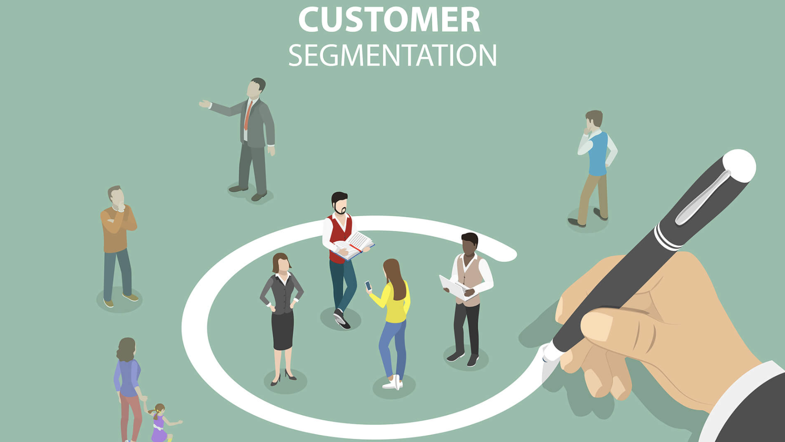

# Data Science Portfolio

I currently develop data science projects focusing on solving business problem. 
Check my portfolio for a deep dive into my work! 👀

---

  
  

    
    <h3><a href="https://leahuynh01.github.io/Customer-Churn-Prediction-Bank-/">🖥 Customer Churn Prediction (Bank)</a></h3>
    
📅 March 20, 2025     
 
    
Customer churn is a critical issue for Banks, leading to revenue loss, low customer engagement and increased acquisition costs. This project aims to predict customer churn by identifying key factors influencing retention and enabling businesses to take proactive measures.

  

  
  

    
    <h3><a href="https://leahuynh01.github.io/Customer-Segmentation-Online-Retail/">🖥 Retail Customer Segmentation and Product Recommendation</a></h3>
    
📅 April 06, 2025     
 
    
This project segments retail customers using RFM analysis and K-Means clustering, followed by product recommendations with the Apriori algorithm, aiming to improve targeted marketing and customer experience.

  

<!-- 
  

    
    <h3><a href="https://github.com/yourusername/project2"> 🖥 Project name</a></h3>
    
📅 Dec 10, 2019

    
Description within 2 to 3 sentences

  

  

    
    <h3><a href="https://github.com/yourusername/project3">🗄 Project name</a></h3>
    
📅 Dec 2, 2019

    
Description within 2 to 3 sentences

  

---

<!-- 🔗 Check out my <a href="https://github.com/yourusername">GitHub</a> for more projects! -->
